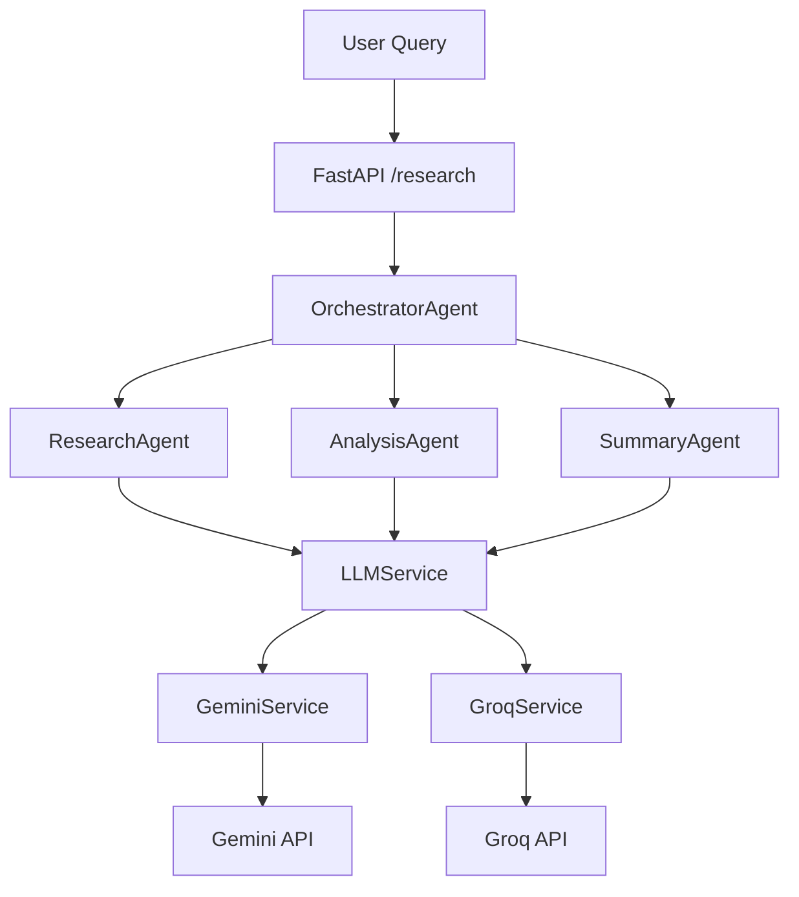

# Multi-Agent Research Assistant

Production-style multi-agent research backend built with Python and FastAPI, powered by Gemini with Groq fallback, and packaged for Docker deployment.

## Project Overview

This project implements a coordinated multi-agent pipeline where each agent has a focused responsibility:

- `Research Agent` gathers detailed topic intelligence.
- `Analysis Agent` extracts insights, trends, risks, and takeaways.
- `Summary Agent` produces a concise executive report.
- `Orchestrator Agent` coordinates the end-to-end workflow.

The API is exposed through FastAPI and supports provider failover between Gemini and Groq.

## Architecture Diagram



## Agent Descriptions

- `ResearchAgent` (`agents/research_agent.py`): Generates comprehensive domain research notes from a user topic.
- `AnalysisAgent` (`agents/analysis_agent.py`): Converts research notes into structured insight and trend analysis.
- `SummaryAgent` (`agents/summary_agent.py`): Produces an executive-grade summary with recommendations.
- `OrchestratorAgent` (`agents/orchestrator_agent.py`): Runs the pipeline (`research -> analysis -> summary`) and returns unified outputs.

## API Endpoints

- `GET /health` - Service liveness check.
- `POST /research` - Executes full multi-agent workflow.

### Example Request

```json
{
  "topic": "Future of AI in healthcare"
}
```

### Example Response

```json
{
  "topic": "Future of AI in healthcare",
  "result": {
    "research_notes": "...",
    "analysis_report": "...",
    "summary_report": "..."
  }
}
```

## Installation Instructions

```bash
python -m venv .venv
source .venv/bin/activate
pip install -r requirements.txt
cp .env.example .env
uvicorn main:app --reload
```

Open Swagger UI at `http://127.0.0.1:8000/docs`.

## Environment Variables

Configure values in `.env`:

- `LLM_PRIMARY_PROVIDER` (`gemini` or `groq`)
- `GEMINI_API_KEY` (required if Gemini is active)
- `GEMINI_MODEL` (default: `gemini-2.5-flash`)
- `GEMINI_TEMPERATURE` (default: `0.2`)
- `GROQ_API_KEY` (required if Groq is active/fallback)
- `GROQ_MODEL` (default: `llama-3.3-70b-versatile`)
- `GROQ_TEMPERATURE` (default: `0.2`)
- `REQUEST_TIMEOUT_SECONDS` (default: `60`)
- `LOG_LEVEL` (default: `INFO`)

## Docker Usage

Build image:

```bash
docker build -t multi-agent-research-assistant .
```

Run container:

```bash
docker run --rm -p 8000:8000 --env-file .env multi-agent-research-assistant
```

## Project Structure

```text
multi-agent-research-assistant/
├── agents/
├── api/
├── models/
├── services/
├── .env.example
├── .gitignore
├── Dockerfile
├── main.py
└── requirements.txt
```

## Future Improvements

- Add unit and integration tests for agents and API routes.
- Add request authentication and rate limiting.
- Add centralized observability (metrics + tracing).
- Add persistent storage for historical research runs.
- Add CI pipeline (lint, tests, build, security scans).

