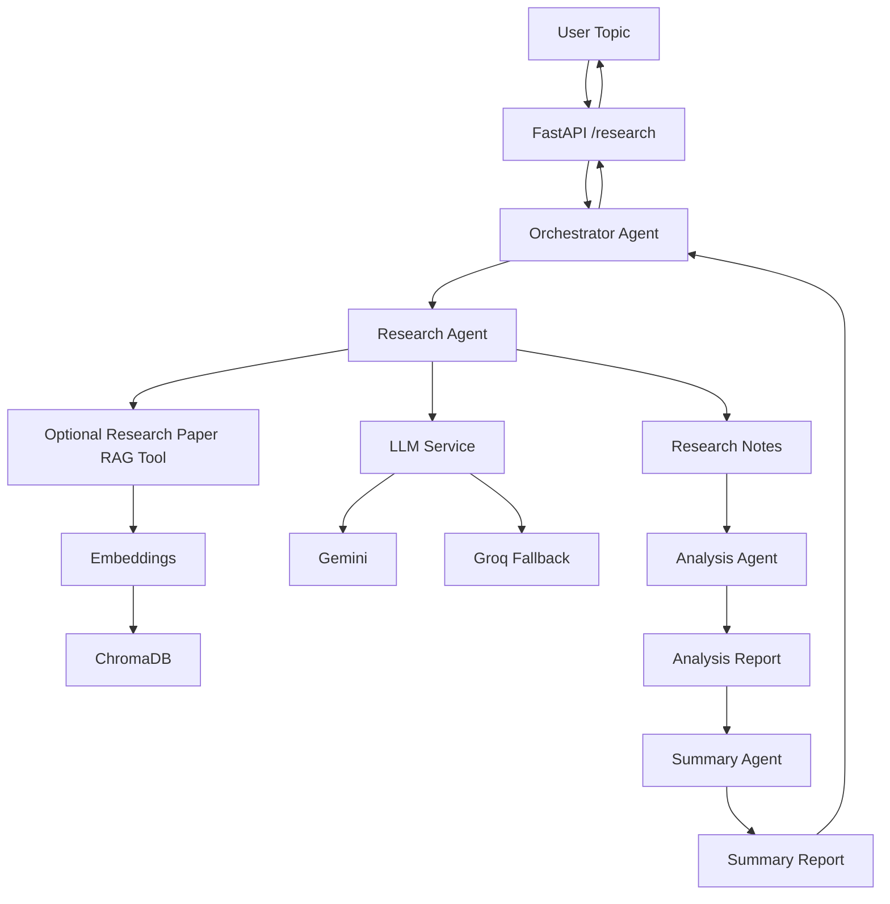

# 🤖 Multi-Agent Research Assistant

> Production-style multi-agent research backend combining **LLMs, agent orchestration, RAG, tool calling, and provider abstraction**.

Built with **Python, FastAPI, Gemini, Groq, ChromaDB, and Docker**.

---

## 🧠 How It Works



### Agent Workflow

**Research → Analysis → Summary**

| Agent | Responsibility |
|---|---|
| 🔎 Research Agent | Generates detailed research notes and can optionally retrieve relevant research papers through RAG |
| 📊 Analysis Agent | Extracts insights, trends, risks, and actionable takeaways |
| 📝 Summary Agent | Produces an executive summary with key findings and recommendations |
| 🎯 Orchestrator Agent | Coordinates the complete workflow and combines the outputs |

RAG is available only to the Research Agent. Analysis and Summary operate on the outputs produced by the preceding stages.

## ⚙️ Key Engineering Highlights

- **Multi-Agent Architecture** — Specialized Research, Analysis, and Summary agents coordinated by an Orchestrator.
- **RAG + Tool Calling** — Research Agent can dynamically invoke a research-paper retrieval tool when indexed knowledge is useful.
- **Semantic Retrieval** — Documents are chunked, embedded using `all-MiniLM-L6-v2`, and stored in ChromaDB.
- **LLM Abstraction** — A unified `LLMService` decouples agent logic from individual LLM providers.
- **Provider Fallback** — Supports Gemini and Groq as interchangeable model backends with fallback handling.
- **Production-Oriented Backend** — FastAPI API layer, configuration management, error handling, timeouts, logging, and Docker support.

## 🔍 RAG Pipeline

```text
Research Papers
      ↓
Document Loading
      ↓
Chunking
      ↓
Sentence Transformer Embeddings
      ↓
ChromaDB
      ↓
Semantic Retrieval
      ↓
Research Agent
```

The Research Agent can use the RAG tool when the LLM determines that indexed research papers are useful for the task.

## 🚀 API

**`GET /health`**
Service liveness check.

**`POST /research`**
Executes the complete multi-agent research workflow.

Request:

```json
{
  "topic": "Future of AI in healthcare"
}
```

Response:

```json
{
  "topic": "Future of AI in healthcare",
  "result": {
    "research_notes": "...",
    "analysis_report": "...",
    "summary_report": "..."
  }
}
```

## 🛠️ Tech Stack

Python · FastAPI · Gemini · Groq · RAG · ChromaDB · Sentence Transformers · LangChain · Docker

## 📁 Project Structure

```text
multi-agent-research-assistant/
├── agents/
│   ├── orchestrator_agent.py
│   ├── research_agent.py
│   ├── analysis_agent.py
│   └── summary_agent.py
├── api/
│   └── routes.py
├── models/
│   └── schemas.py
├── rag/
│   ├── document_loader.py
│   ├── chunker.py
│   ├── embeddings.py
│   ├── vector_store.py
│   ├── retriever.py
│   ├── research_paper_tool.py
│   └── pipeline.py
├── services/
│   ├── llm_service.py
│   ├── gemini_service.py
│   ├── groq_service.py
│   ├── config.py
│   ├── dependencies.py
│   ├── exceptions.py
│   └── logger.py
├── scripts/
│   └── manual_checks/      # ad-hoc scripts for exercising the pipeline against live providers
├── Dockerfile
├── main.py
├── requirements.txt
└── .env.example
```

## ⚡ Getting Started

Create a virtual environment, install the project dependencies, and start the FastAPI development server:

```bash
python -m venv .venv
source .venv/bin/activate
pip install -r requirements.txt

cp .env.example .env
uvicorn main:app --reload
```

API documentation: `http://127.0.0.1:8000/docs`

### Environment Variables

Configure your `.env`:

```env
LLM_PRIMARY_PROVIDER=gemini

GEMINI_API_KEY=your_key
GEMINI_MODEL=gemini-2.5-flash
GEMINI_TEMPERATURE=0.2

GROQ_API_KEY=your_key
GROQ_MODEL=llama-3.3-70b-versatile
GROQ_TEMPERATURE=0.2

REQUEST_TIMEOUT_SECONDS=60
LOG_LEVEL=INFO
```

## 🐳 Docker

Build the image:

```bash
docker build -t multi-agent-research-assistant .
```

Run the application:

```bash
docker run --rm -p 8000:8000 --env-file .env multi-agent-research-assistant
```

## 🔮 Future Improvements

- Unit and integration tests for agents and API routes (with mocked LLM/vector-store calls)
- Authentication and rate limiting
- Centralized observability with metrics and tracing
- Persistent storage for research history
- CI/CD pipeline for linting, testing, builds, and security scans